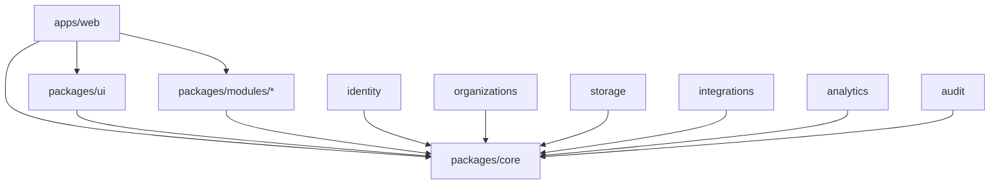
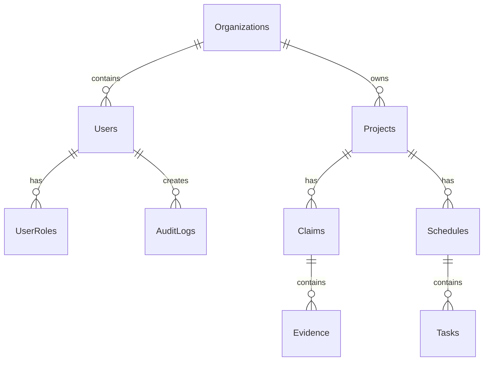
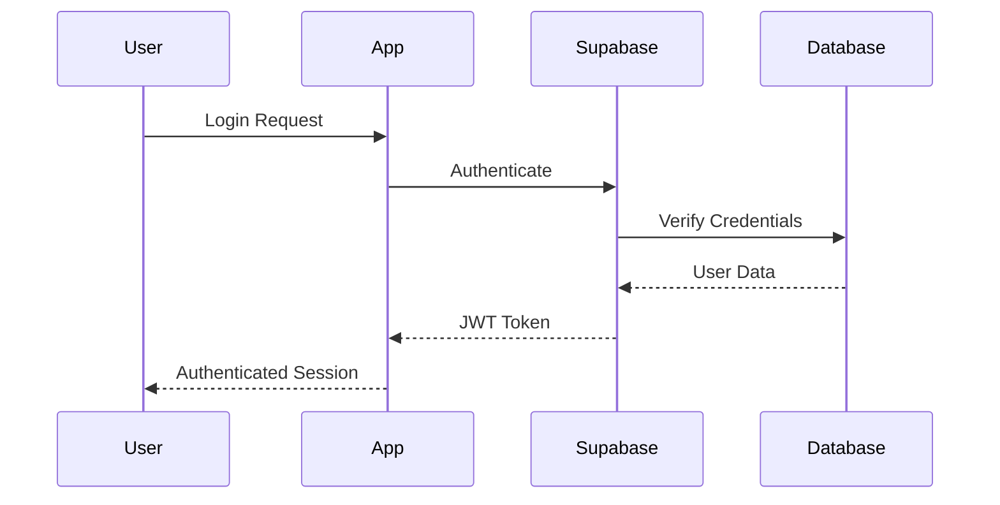
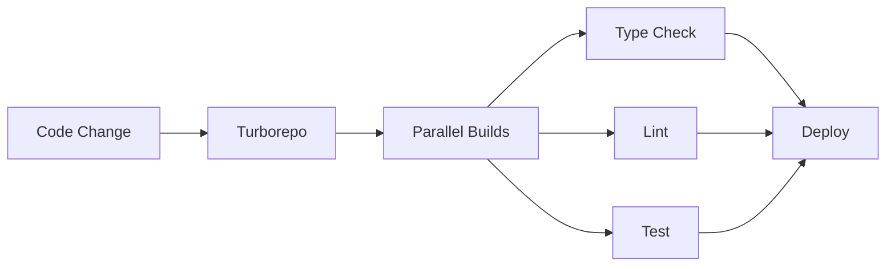

# EOT Intelligence Platform - Architecture Overview

This document provides a comprehensive overview of the EOT Intelligence Platform architecture, built as a modern monorepo with Next.js 14 App Router, Supabase, and Turborepo.

## Table of Contents

- [High-Level Architecture](#high-level-architecture)
- [Monorepo Structure](#monorepo-structure)
- [Application Layer](#application-layer)
- [Package Architecture](#package-architecture)
- [Data Layer](#data-layer)
- [Authentication & Security](#authentication--security)
- [Build & Deployment](#build--deployment)
- [Integration Points](#integration-points)
- [Scalability Considerations](#scalability-considerations)

## High-Level Architecture

The EOT Intelligence Platform follows a modern, scalable architecture pattern:

```
┌─────────────────┐    ┌─────────────────┐    ┌─────────────────┐
│   Frontend      │    │   Backend       │    │   Database      │
│   (Next.js)     │◄──►│   (Supabase)    │◄──►│   (PostgreSQL)  │
│                 │    │                 │    │                 │
│  - App Router   │    │  - Auth         │    │  - Tables       │
│  - Components   │    │  - APIs         │    │  - RLS          │
│  - Middleware   │    │  - Storage      │    │  - Functions    │
└─────────────────┘    └─────────────────┘    └─────────────────┘
         │                       │                       │
         └───────────────────────┼───────────────────────┘
                                 │
                    ┌─────────────────┐
                    │   Build System  │
                    │   (Turborepo)   │
                    │                 │
                    │  - Caching      │
                    │  - Parallelism  │
                    │  - Dependencies │
                    └─────────────────┘
```

### Core Principles

1. **Monorepo Architecture**: Single repository with multiple packages for better code sharing and consistency
2. **Type Safety**: End-to-end TypeScript with strict mode for reliability
3. **Modern Stack**: Latest versions of Next.js, React, and supporting libraries
4. **Real-time Capabilities**: Supabase real-time subscriptions for live updates
5. **Performance**: Optimized builds, caching, and code splitting
6. **Security**: Row Level Security, authentication middleware, and secure defaults

## Monorepo Structure

The monorepo is organized into apps and packages:

```
eot-intelligence-app/
├── apps/
│   └── web/                    # Main Next.js application
├── packages/
│   ├── core/                   # Shared utilities and types
│   ├── ui/                     # Shared UI components
│   └── modules/                # Business logic modules
│       ├── identity/           # Authentication & sessions
│       ├── organizations/      # Multi-tenancy
│       ├── storage/            # Database layer (Prisma)
│       ├── integrations/       # External integrations
│       ├── analytics/          # Analytics
│       └── audit/              # Audit logging
├── tests/                      # E2E tests (Playwright)
├── docs/                       # Documentation
├── turbo.json                  # Turborepo configuration
└── pnpm-workspace.yaml         # PNPM workspace configuration
```

### Package Dependencies



## Application Layer

### Next.js 14 App Router

The main application uses Next.js 14 with the App Router pattern:

```
apps/web/app/
├── (auth)/                     # Auth route group
│   ├── layout.tsx              # Auth layout
│   ├── login/page.tsx          # Login page
│   └── register/page.tsx       # Register page
├── (dashboard)/                # Dashboard route group
│   ├── layout.tsx              # Dashboard layout
│   ├── dashboard/page.tsx      # Main dashboard
│   ├── projects/               # Projects section
│   │   ├── page.tsx            # Projects list
│   │   └── [projectId]/        # Dynamic project routes
│   └── settings/               # Settings section
├── layout.tsx                  # Root layout
├── page.tsx                    # Home page
└── globals.css                 # Global styles
```

### Route Groups

- **(auth)**: Authentication-related pages with minimal layout
- **(dashboard)**: Main application pages with full navigation
- **API routes**: Server-side API endpoints for business logic

### Middleware

```typescript
// apps/web/middleware.ts
export function middleware(request: NextRequest) {
  // Authentication checks
  // Route protection
  // Session management
}
```

## Package Architecture

### Core Package (`packages/core/`)

Shared utilities and types used across all applications:

```typescript
// packages/core/src/
├── types.ts                    # Global TypeScript types
├── constants.ts                # Application constants
├── utils.ts                    # Utility functions
└── index.ts                    # Package exports
```

**Key Features:**
- Global TypeScript interfaces
- Shared utility functions
- Application constants
- Common validation schemas

### UI Package (`packages/ui/`)

Shared React components built on ShadCN/UI:

```typescript
// packages/ui/src/
├── components/
│   ├── ui/                     # Base ShadCN components
│   └── layout/                 # Layout components
├── hooks/                      # Custom React hooks
├── lib/                        # UI utilities
└── index.ts                    # Component exports
```

**Key Features:**
- Reusable UI components
- Consistent design system
- Tailwind CSS integration
- Accessible components (Radix UI)

### Module Packages

#### Identity Module (`packages/modules/identity/`)

Authentication and session management:

```typescript
// packages/modules/identity/src/
├── auth.ts                     # Auth utilities
├── auth-service.ts             # Auth business logic
├── hooks.tsx                   # React hooks for auth
├── middleware.tsx              # Auth middleware
├── sessions.ts                 # Session management
└── supabase.ts                 # Supabase client
```

**Features:**
- Supabase Auth integration
- Session management
- Role-based access control
- Multi-factor authentication
- OAuth provider support

#### Organizations Module (`packages/modules/organizations/`)

Multi-tenancy and organization management:

```typescript
// Features:
- Organization creation and management
- User invitation and role assignment
- Team management
- Resource access control
```

#### Storage Module (`packages/modules/storage/`)

Database layer with Prisma ORM:

```typescript
// packages/modules/storage/
├── prisma/
│   └── schema.prisma           # Database schema
├── src/
│   ├── database.ts             # Database client
│   ├── types.ts                # Database types
│   └── utils.ts                # Database utilities
└── seed.ts                     # Database seeding
```

**Features:**
- Prisma ORM integration
- Type-safe database operations
- Database migrations
- Seeding and fixtures
- Connection pooling

## Data Layer

### Database Schema

The application uses a PostgreSQL database with the following key entities:

```sql
-- Core Entities
Users                           # User accounts and profiles
Organizations                   # Multi-tenant organizations
Projects                        # Construction projects
Claims                          # EOT claims
Evidence                        # Supporting documentation
Schedules                       # Project schedules
Tasks                          # Schedule tasks

-- Supporting Entities
UserRoles                       # Role assignments
Permissions                     # Permission definitions
AuditLogs                       # Activity tracking
Files                          # File metadata
Notifications                   # User notifications
```

### Database Relationships



### Row Level Security (RLS)

Supabase RLS policies ensure data isolation:

```sql
-- Users can only access their organization's data
CREATE POLICY org_isolation ON projects
FOR ALL USING (
  organization_id IN (
    SELECT organization_id FROM user_organizations 
    WHERE user_id = auth.uid()
  )
);
```

## Authentication & Security

### Authentication Flow



### Security Features

1. **Authentication**: Supabase Auth with multiple providers
2. **Authorization**: Role-based access control (RBAC)
3. **Data Security**: Row Level Security policies
4. **Session Management**: Secure JWT tokens with refresh
5. **HTTPS**: Enforced in production
6. **CORS**: Configured for secure cross-origin requests

### User Roles

- **Director**: Full system access, organization management
- **Project Manager**: Project-level access, team management
- **Scheduler**: Schedule management, task tracking
- **Contractor**: Limited access to assigned projects

## Build & Deployment

### Turborepo Configuration

```json
{
  "tasks": {
    "build": {
      "dependsOn": ["^build"],
      "outputs": [".next/**", "dist/**"]
    },
    "dev": {
      "cache": false,
      "persistent": true
    }
  }
}
```

### Build Pipeline



### Deployment Strategy

- **Development**: Local development server
- **Staging**: Vercel preview deployments
- **Production**: Vercel production deployment
- **Database**: Supabase hosted PostgreSQL

## Integration Points

### External Systems

The platform is designed to integrate with:

1. **Project Management**
   - Primavera P6
   - Microsoft Project
   - Custom schedule imports

2. **Document Management**
   - SharePoint
   - Google Drive
   - Local file systems

3. **Communication**
   - Email systems
   - Slack/Teams
   - SMS notifications

4. **Analytics**
   - Custom dashboards
   - Reporting tools
   - Data exports

### API Design

```typescript
// Example API structure
/api/
├── auth/                       # Authentication endpoints
├── projects/                   # Project management
├── claims/                     # Claims handling
├── evidence/                   # Evidence management
├── schedules/                  # Schedule operations
└── webhooks/                   # External integrations
```

## Scalability Considerations

### Horizontal Scaling

- **Frontend**: CDN distribution via Vercel
- **Database**: Supabase connection pooling
- **Build System**: Turborepo remote caching
- **Assets**: Supabase Storage with CDN

### Performance Optimizations

1. **Code Splitting**: Automatic with Next.js
2. **Image Optimization**: Next.js Image component
3. **Caching**: Turborepo build cache
4. **Database**: Indexed queries and connection pooling
5. **Real-time**: Optimized Supabase subscriptions

### Monitoring & Observability

- **Error Tracking**: Sentry integration
- **Performance**: Vercel Analytics
- **Database**: Supabase metrics
- **Logs**: Structured logging with pino

## Future Considerations

### Planned Enhancements

1. **Microservices**: Gradual extraction of modules
2. **Mobile App**: React Native application
3. **AI/ML**: Intelligent claim analysis
4. **Offline Support**: Progressive Web App features
5. **Multi-region**: Global deployment strategy

### Technology Evolution

- **Database**: Potential migration to distributed systems
- **Real-time**: Enhanced WebSocket capabilities
- **Security**: Advanced threat detection
- **DevOps**: Kubernetes deployment options

## Conclusion

The EOT Intelligence Platform architecture provides a solid foundation for a scalable, maintainable construction claims management system. The monorepo structure enables efficient development while the modern technology stack ensures performance and reliability.

For implementation details, see:
- [SETUP.md](./SETUP.md) - Development setup
- [CLAUDE.md](./CLAUDE.md) - Development guidelines
- [DEPLOYMENT.md](./DEPLOYMENT.md) - Deployment procedures